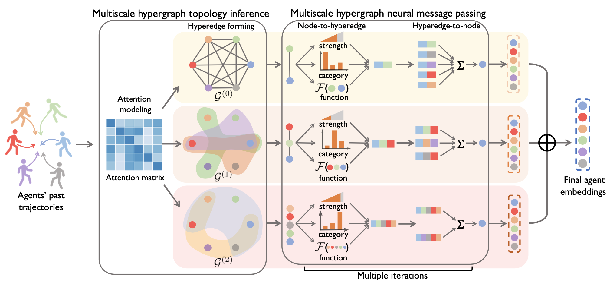
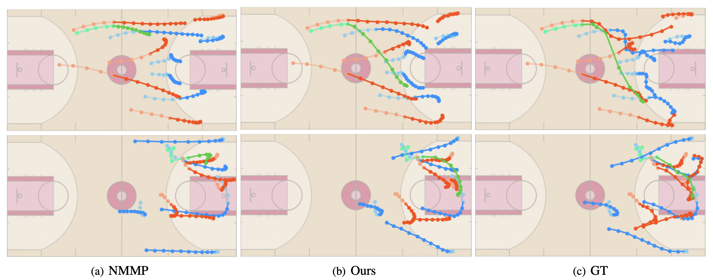

# GroupNet: Multiscale Hypergraph Neural Networks for Trajectory Prediction with Relational Reasoning

**Official PyTorch code** for CVPR'22 paper "GroupNet: Multiscale Hypergraph Neural Networks for Trajectory Prediction with Relational Reasoning".



**Abstract**: Demystifying the interactions among multiple agents from their past trajectories is fundamental to precise and interpretable trajectory prediction. However, previous works only consider pair-wise interactions with limited relational reasoning. To promote more comprehensive interaction modeling for relational reasoning, we propose GroupNet, a multiscale hypergraph neural network, which is novel in terms of both interaction capturing and representation learning. From the aspect of interaction capturing, we propose a trainable multiscale hypergraph to capture both pair-wise and group-wise interactions at multiple group sizes. From the aspect of interaction representation learning, we propose a three-element format that can be learnt end-to-end and explicitly reason some relational factors including the interaction strength and category. We apply GroupNet into both CVAE-based prediction system and previous state-of-the-art prediction systems for predicting socially plausible trajectories with relational reasoning. To validate the ability of relational reasoning, we experiment with synthetic physics simulations to reflect the ability to capture group behaviors, reason interaction strength and interaction category. To validate the effectiveness of prediction, we conduct extensive experiments on three real-world trajectory prediction datasets, including NBA, SDD and ETH-UCY; and we show that with GroupNet, the CVAE-based prediction system outperforms state-of-the-art methods. We also show that adding GroupNet will further improve the performance of previous state-of-the-art prediction systems. 


We give an example of trajectories predicted by our model and the corresponding ground truth on NBA dataset as following:



## Requirement

### Recommend Environment

* Tested OS: Linux / RTX 3090
* Python == 3.7.11
* PyTorch == 1.8.1+cu111

### Dependencies

Install the dependencies from the `requirements.txt`:
```linux
pip install -r requirements.txt
```

## Data preparation
You can directly use the preprocessed data of NBA SportsVU in [`datasets/nba`](datasets/nba) including train.npy and test.npy as training and testing data. If you want to sample trajecory by yourself, simply download datafiles from ['NBA-Player-Movements'](https://github.com/linouk23/NBA-Player-Movements/tree/master/data/2016.NBA.Raw.SportVU.Game.Logs) and put them in [`datasets/nba/source`](datasets/nba/source). Then run:
```
python generate_dataset.py
```

## Training
To train a GroupNet model on the NBA dataset, simply run:
```
python train_hyper_nba.py --gpu {your_gpu_id}
```

Training models will be saved in ['saved_models/nba'](saved_models/nba)


## Evaluating

To evalutate the model performance, simply run:

```
python test_nba.py --gpu {your_gpu_id} --model_names {your_model_name}
```
We provide a pretrained model which is slightly better than the performance reported in our paper in ['saved_models/nba/pretrain.p'](saved_models/nba/pretrain.p). 

To evalutate the pretrained model, simply run:
```
python test_nba.py --gpu {your_gpu_id} --model_names pretrain
```


## Acknowledgement

We thanks for the NBA data provided by ['NBA-Player-Movements'](https://github.com/linouk23/NBA-Player-Movements). We also thanks for the part of code of NRI and NMMP, whose github repo is [NRI code](https://github.com/ethanfetaya/NRI) and [NMMP code](https://github.com/PhyllisH/NMMP). We thank the authors for releasing their code.

## Citation

If you use this code, please cite our paper:

```
@InProceedings{xu2022GroupNet,
author = {Xu, Chenxin and Li, Maosen and Ni, Zhenyang and Zhang, Ya and Chen, Siheng},
title = {GroupNet: Multiscale Hypergraph Neural Networks for Trajectory Prediction with Relational Reasoning},
booktitle = {The IEEE/CVF Conference on Computer Vision and Pattern Recognition (CVPR)},
year = {2022}
}
```